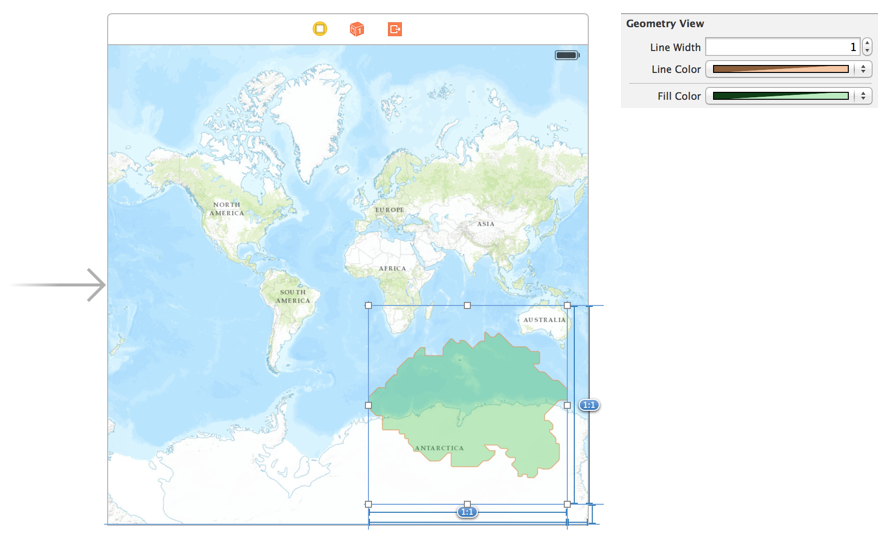

swift-arcgis-runtime-experiments
================================

Experiments in Swift with the ArcGIS Runtime SDK for iOS

A few components and experiments in Swift and Xcode 6 to work with the ArcGIS Runtime SDK for iOS.

##AGSGeometry
####Custom Operators
Defining some operators (which make use of Generics) to handle common `AGSGeometry` operations.

Underlying the operators is the AGSGeometryEngine. Where previously you would have to write something like

```
AGSPolygon *projectedGeom = [[AGSGeometryEngine defaultGeometryEngine] projectGeometry:geom toSpatialReference:self.mapView.spatialReference]
```

you can now write

```
let projectedGeom = geom >> mapView.spatialReference
```

The following Swift infix operators are ovelrloaded. Note that in all cases except `>>` the types of geometry must match:

| Operator | Geometry Operation | Example | Notes |
| -------- | ------------------ | ------- | ----- |
| >>       | Reproject | `let projected = geom >> mapView.spatialReference` | |
| +, &#124;, &#124;&#124; | [Union](http://resources.esri.com/help/9.3/arcgisengine/arcobjects/esriGeometry/ITopologicalOperator_Union.htm) | `let unionPoly = polygon1 + polygon2` | |
| &, &&    | [Intersection](http://resources.esri.com/help/9.3/arcgisengine/arcobjects/esriGeometry/ITopologicalOperator_Intersect.htm) | `let intersectPoly =  polygon1 + polygon2` | |
| -        | [Difference](http://resources.esri.com/help/9.3/arcgisengine/arcobjects/esriGeometry/ITopologicalOperator_Difference.htm) | `let diffPoly = polygon1 - polygon2 ` | Order is significant|
| ^         | [Symmetric Difference](http://resources.esri.com/help/9.3/arcgisengine/arcobjects/esriGeometry/ITopologicalOperator_SymmetricDifference.htm) | `let symmetricDiffPoly = polygon1 ^ polygon2 ` | |

__Notes__:

 1. The Difference operator `-` could technically accept different kinds of geometry, but that's not being considered for now.
 2. In the above examples, polygons are shown, but the operators support `AGSPoint`, `AGSMultipoint`, `AGSPolyline` and `AGSPolygon`.

##User Interface
####AGSGeometryView
Making use of `@IBDesignable` and `@IBInspectable` along with `prepareForInterfaceBuilder()`, provide a design-time interactive Geometry Viewer. The `AGSGeometryView` class can display a Polyline or Polygon scaled to the underlying view. Use this in Collection Views or Table Views, or as in the screenshot below (taken from Xcode6 beta 2), overlaid directly on the map or another control.


####AGSDesignableMapView
Making use again of `@IBDesignable` and `prepareForInterfaceBuilder()`, use a hard-coded PNG image of the Topographic Basemap to represent a MapView in Interface Builder at design time. This is also visible in the above screenshot.
